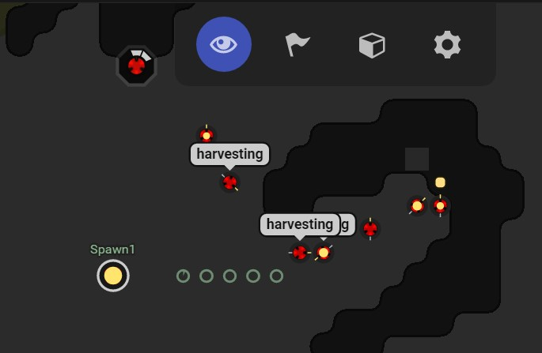
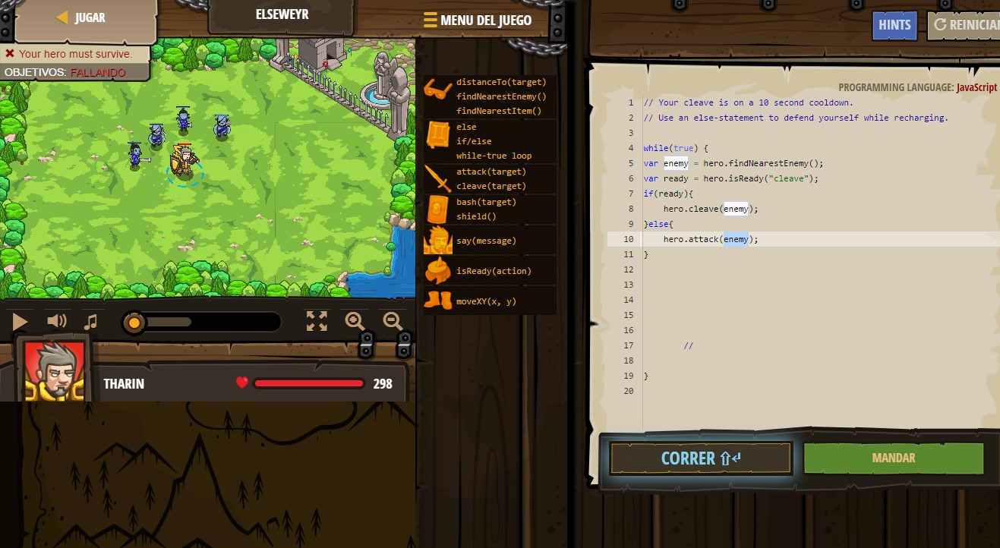

#[Screeps](https://screeps.com/)

Se describe como un juego para programadores. Programa a tu colonia de creeps para que se expanda y conquiste nuevas zonas. Un MMO de estrategia en mundo abierto en que se programa usando javascript y un poco de node.

Los primeros pasos se sintieron lentos.Tras hacer los tutoriales lo conecté con github y a través de este con mi IDE en lo cual tarde con 2 o 3 horas como poco. Sin embargo, después me enganche al juego. Lo primero que hice fue empezar refactorizar el código de los tutoriales lo cual fue muy divertido quizás porque es la primera que trabajo programando una IA. Fue una de esas cosas que se vuelven divertidas de programar.

### Hay 3 modos de juegos en el simulador al margen de mundo abierto.
- **Tutorial**.Te enseñan un poco como funciona el juego y los métodos básicos. El tutorial está bien hecho y tiene el código de los tutoriales en github.

- **Entrenamiento**.Me vuelto adicto a este modo de juego. A partir de tus scripts vas programando todo el comportamiento de tus screeps en tu habitación, algo así como modo un jugador .Siendo así de sencillo este modo te da decenas de horas de juego hasta que este contento con el comportamiento de tus screeps.

- **Custom**.Desgraciadamente, no he llegado a jugar este modo porque mi código no estaba preparado. Se trata de un giro de tuerca al modo entrenamiento al que han mejorado añadiéndole la posibilidad de editar el terreno y creo que la posibilidad de jugar con un amigo. Me da la impresión que esto va multiplicar mis horas de juego con el simulador.

**Mundo Abierto.**
En funcionamiento es igual al simulador pero colocándote en mundo abierto donde puedes atacar y ser atacado. Existe una regiones donde empiezas durante alrededor de 30 días depende de la región que escojas donde estás protegido y solo jugarás con gente de tu nivel. A terminar el periodo de tiempo la barrera se rompe y eres libre para conquistar el mundo

Yo solo jugué al simulador principalmente porque el mundo abierto es de pago aunque he de reconocer que mis creeps apenas llegaron a ser aptos para el salto al mundo abierto. Tiene una documentación bastante completa y me quede impresionado con la cantidad de horas de juego que te da el simulador. Me quede con muchas ganas de añadir esta o aquella funcionalidad. Es un juego que recomiendo sobretodo si quieres una excusa para empezar a programa un IA.

<iframe width="560" height="315" src="https://www.youtube.com/embed/0DtltU9ozHI" frameborder="0" allowfullscreen></iframe>
https://www.youtube.com/watch?v=0DtltU9ozHI

#[CodeCombat](https://codecombat.com/play)

Este juego está enfocado a niños lo veo bien para personas que no sepan programar que quieran iniciarse además creo que cuenta con modo de pago para aprender html por lo que puede ser ideal para que cualquiera empiece a familiarizarse con la programación.

En el juego tienes que controlar a tu héroe mejorar sus estadísticas y  superar numerosas quest programando sus movimientos. Tiene soporte para aprender javascript, python, coffescript(una versión simplificada de javascript) y lua.
Para mi que soy programador me pareció lento y tedioso pero incluso en ese primer momento tuve que reconocer que te metía dentro del juego y en ciertos momentos te olvidas de que estas programando. 

Decidí empezar a jugar con mi primo pequeño para intentar ver el juego con otra perspectiva. En una mañana mi primo cogió algo de soltura con la programación y lo mejor se sentía como si simplemente estuviésemos jugando juntos, la programación paso a un segundo plano.
Aunque llego un punto en el que fue difícil avanzar, cuando empezamos con los bucles, me gustaría que el juego mejorara en ese aspecto.

En el juego puedes desbloquear un modo duelo donde la IA de tu protagonista pueda luchar contra otros jugadores. La lastima que entre que muchos son niños que no saben programar y otros tienen la mejor espada del juego no hay mucho espacio para competir. También es verdad que juguemos con el guerrero quizás con personajes a distancia la cosa cambie.

Mi conclusión es un juego muy bueno con una gran cantidad de contenido tanto gratuito como de pago omitiendo el problema con los tiempos de cargar lo cual no es raro un juego de navegador, la verdad es que consigue transformar la programación en juego entretenido y alcance de todos. El juego no es para mi pero no me extrañaría que otra persona le encantará .Es decir, no lo recomendaría a programadores experimentados sino a personas que quieran dar sus primeros pasos en programación sin dedicarle una gran inversión de tiempo y por supuesto es ideal para niños.

