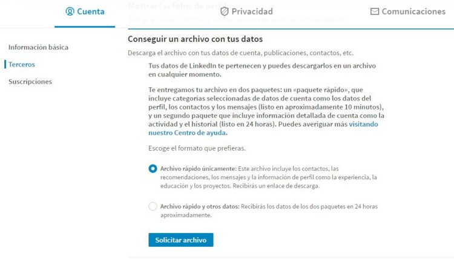

Buenas, yo se nada sobre la mejor o la peor o manera de hacer un curriculum.Pero si sé una cosa odio invertir tiempo en mantener información por duplicada.
Muchas personas me han recomendado con razón tener un perfil de Linkedin, sin embargo me siento como si estuviera trabajando el doble al tener que mantener actualizada la información 
profesional tanto en mi perfil de Linkedin como en mi cv.Quizás simplemente sea un poco maniático con la información, me podéis llamar informático para abreviar.
Ahora enserio esta es la típica cosa que unas personas le resultará super util y a otras personas será inútil, yo la verdad simplemente disfruto actualizando los 
datos y viendo como el curriculum se actualiza solo. 

Si sois tan maniáticos como yo podéis seguir los siguientes pasos:

### - Primer Paso, **extraer los datos de Linkedin.**
Realmente es fácil de hacer pero se me hizo un poco dura porque no sabia como hacerlo exactamente.
Encontré dos opciones, intentar utilizar la Api o pedir a Linkedin que te envié tus datos. Sorprendentemente, el segundo resulta más fácil, cómodo 
y es algo casi inmediato para lo que queremos aunque no descarto hacer un intento con la Api en el futuro. 
El siguiente enlace os redirige directamente donde podéis descargar vuestra información.
Recomiendo elegir la opción **"Archivo rápido únicamente"**.Para terminar ir a vuestro correo seguid los pasos y tendréis un zip con vuestro datos.
    
        

### - Segundo paso, **pasar de csv a json**.
Problema cuando extraemos los datos, nos damos cuenta que nuestros datos están en .csv y lo peor en archivos distintos.
Podéis programar vosotros mismo un conversor que coja vuestro zip seleccione vuestro archivos y lo convierta a un .json o el formato que queráis yo uso un 
json o podéis usar este <a href="https://jmperezperez.com/linkedin-to-json-resume/" target="_blank">linkedin-to-json-resume</a>. Me he basado en está página para crear este articulo.
Pero hay un pequeño problema, tal como está hoy, este conversor hay cierto datos que no nos extrae. Lo que hago es buscar el .csv con los datos que me faltan 
convertirlos con un <a href="http://www.csvjson.com/csv2json" target="_blank">conversor online</a> y unirlo a la parte final de json que ya me tenía. ¿Por que no he programado un  
que se adapte a mis necesidades? Simplemente, yo actualizo mi cv entre 3 meses a 1 año y todo este el proceso un vez sabes hacerlo tardas como 20 min en actualizar
tu .json. Quizás un día lo programe por amor al arte pero a día de hoy no creo me compense automatizar el proceso.
    
```
"basics": {
    "name": "Jonay Eliezer Godoy Reyes",
    "label": "Developer",
    "phone": "",
    "website": "",
    "summary": "Apasionado por el aprendizaje",
    "location": {
    "address": "",
        "postalCode": "",
        "city": "",
        "countryCode": "",
        "region": ""
    },
    "profiles": []
},
"work": [
    {
        "company": "Codesai",
        "position": "Alumno Practicas",
        "website": "",
        "startDate": "2017-03-01",
        "summary": "-Aprender. A través de practicas como mob-programming, libros, cursos e implementando\nfuncionalidades en algunos proyectos siempre buscando hacerlo de le mejor manera posible.\nAsi como metodologias como integración continua y TDD\n-Las tecnologías que utilizamos fueron javascript, react-redux y springboot(java). Asi como\nherramientas complementarias para testear Jest, mocha, junit, selenium.",
        "highlights": [],
        "endDate": "2017-06-01"
    },.....
```
    
### - Tercer paso, **ya tengo mi .json es hora de darle formato.**
Yo de momento el .json lo meto dentro de un archivo .js y lo importo a un html porque me es más cómodo por supuesto
ustedes tenéis libertad para usar otro método.
Ahora solo queda darle formato al html a vuestro gusto. Recomiendo que también busquéis como convertirlo a .pdf, yo por ahora lo hago de la manera más rápida 
imprimiendo con el navegador, también existen páginas y plugins que os permite seleccionar una parte de html para imprimirlo, o incluso existe la posibilidad de 
definir en un css como se ve una página web a la hora de imprimir.
    
    
    
Para terminar os pongo un enlace a <a href="../conoceme" target="_blank">mi cv en html</a> y a mi <a href="https://www.linkedin.com/in/jonay-eliezer-godoy-reyes-34a099111" target="_blank">Linkedin</a>
por queréis ver un ejemplo.

<a href="https://jmperezperez.com/linkedin-to-json-resume/" target="_blank">referencia: https://jmperezperez.com/linkedin-to-json-resume/</a>