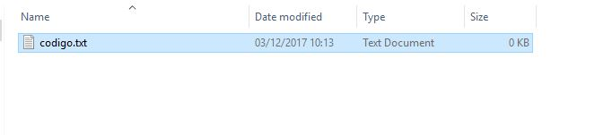

Hoy voy a hablar del comando de git "--no-ff" sobretodo porque cuando vi este comando
me pregunte ¿Por que alguien iba a querer evitar el fast forward? Por suerte
unos meses después alguien fue tan amable de explicarlo. Básicamente mejora
la historias de usuario de git. Obviamente, aquí no acaba el articulo 
A continuación tenéis un ejemplo.

Empiezo con una carpeta repositorio y una archivo llamado codigo.txt sobre los que hago
un repositorio de git y mi primer commit.

Hasta aquí todo bien. Ahora creo una rama develop y me muevo a ella.
Podemos suponer que Master es producción y develop es develop,

Ahora desde develop editamos codigo.txt y hacemos un commit. Yo use vim,
podéis usar cualquier editor como si es el notepad.

Muestro el log de la historia de usuario que tenemos hasta ahora.

Vamos a empezar a comparar me paso a la rama master. Hago un merge y como
es normal hace un fast forward.

Veamos la historia de usuario resultante.Como podéis observar Master(producción)
se encuentra actualizado. Aunque eso si, no sabemos bien como se hizo esta actualización.

Segundo caso. Hacemos un reset y una vez regresamos en el tiempo volvemos a hacer un merge
pero esta vez añadimos --no-ff

Veamos la historia de usuario resultante.

Este log nos muestra mucha más información. Antes solo se podría 
apreciar que Master(producción) y que develop se encontraba en el mismo estado quien había actualizado
a quien era un completo misterio.
Dependiendo del contexto esta información no será importante o será fundamental.
Con este caso he intentado reflejar que cuando se actualiza una aplicación pasamos de la rama desarrollo a la de producción 
 y que en ese contexto mantener esa información ayuda considerablemente a comprender la evolución de un proyecto. 

