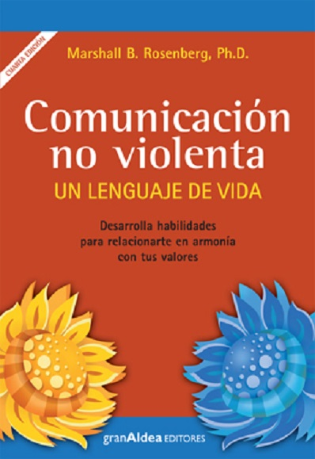
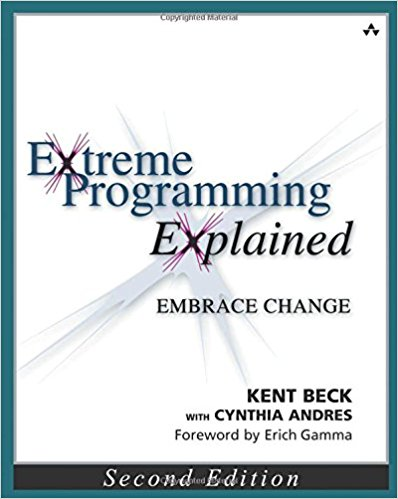
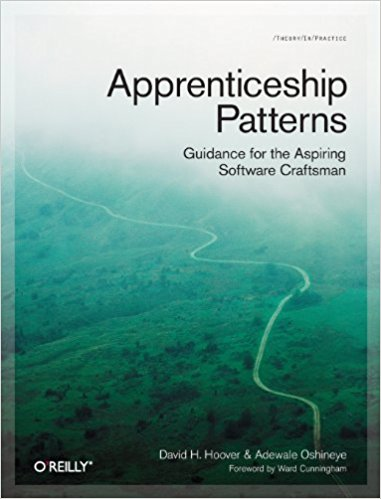

Primero de todo perdonar por el nombre del articulo no tuve 
imaginación para pensar un nombre mejor.

En este capitulo quiero hacer un breve resumen de los últimos 4 libros.

Desde hace un tiempo he ido recuperando el placer de la lectura. Cuando era niño
leia creo que bastante pero solo novelas, termine perdiendo el habito porque
no he encontraba libros que me gustarán. Por otro lado a dia de hoy esta 
clase se libros ya no me gustan, si es mejor calidad que una pelicula pero personalmente no voy a dedicar
3 meses a leer un historia esa clase se ocio de mi perspectiva no lo vale la inversión. Y una vez tienes
un compresión lectora básica aportan poco. Sin embargo, he me reencontrado, tanto lo libros de 
texto como otras clases libros didácticos.

Gracia a ellos, he podido aprender conceptos que abren mi perspectiva y me dan espacio
para asimilar conceptos profundos que no he sido capaz de terminar de asimilar de otras formas.
He tenido la suerte de tener ha muchas personas que me han enseñado mucho pero 
cuando ellos me enseñaban muchas cosas aprendí por imitación y poco a poco fue comprendiendo
muchos de los valores que estaban detrás de la practicas que me enseñaron. Sin embargo,
varios de esos conceptos y valores nunca me llegaron. Con los libros consigo terminar de aprenderlos
tomándome mi tiempo si el limite de 2 horas que es lo que suele tomar una kata.
Y lo mejor es cuando se unen las dos cosas cuando un compañero te enseña
y un dia te recomienda un cierto libro es un experiencia genial. Es leer el libro y todos
esos conceptos y practicas que tu compañero te ha estado explicando se ven reflejados en el
libro. "Ahh claro por eso hacia esto", o el simple hecho ordenar en tu cabeza todas esas ideas que te 
ha ido trasmitiendo. Me gusta leer pero incluso más que eso me gusta leer los libros que me han
recomendado todas esas personas que acompañan y me han acompañado en mi camino del aprendizaje.

Salvo un libro todos son en inglés pero a pesar de mi nivel de inglés los traductores me ha ayudado al salir del paso.

Me dejo de ir por las ramas empiezo con los últimos 4 libros que leído a fecha de hoy.

- Titulo: [JavaScript Allongé, the "Six" Edition](https://leanpub.com/javascriptallongesix)
-  Autor: [Reg “raganwald” Braithwaite](https://twitter.com/raganwald)
- [Leer online](https://leanpub.com/javascriptallongesix/read)
- [Descargar pdf](http://samples.leanpub.com/javascriptallongesix-sample.pdf)
- [Comprar](https://leanpub.com/javascriptallongesix)
- Mi breve descripción:
    - A este libro le debo en gran parte mi pasión por javascript. Fue un libro que marco una transición para mi. Es el primer libro que he leído en javascript.
    Es un libro complejo y denso. Trabaje duro para acabarlo y creo que ha dia de hoy debería
    darle un segunda lectura porque  hay muchos conceptos y patrones complejos que no terminé de asimilar.
    Lo leia con un ordenador y compañero al lado convirtiendo muchos de los ejemplos del 
    libro a test mientras nos peleábamos por comprenderlos.
    Es un libro muy completo que se actualiza con el paso de tiempo. Es lo libro que creo que puede aportar mucho a una persona independientemente de su nivel de javascript a pesar de la gran curva de aprendizaje que tiene.
    Se puede tanto comprar como leer de manera gratuita.
    Si vas a comenzar con javascript quizás los libros de [You Don't Know JS](https://github.com/getify/You-Dont-Know-JS), 
    podría ser más suaves me he leído el primero y parece que la curva de aprendizaje es menos dura que con Javascript Allongé 
    y tiene muy buena pinta espero terminarlos un dia de estos. 

- Titulo: [Comunicacion No Violenta un Lenguaje de Vida](https://www.amazon.es/Comunicaci%C3%B3n-no-violenta-lenguaje-vida/dp/987218349X)
- Autor: Marshall B. Rosenberg
- Idioma : Español
- [Comprar](https://www.amazon.es/Comunicaci%C3%B3n-no-violenta-lenguaje-vida/dp/987218349X)
- Mi breve descripción:
    - Este el libro es el que más he ojeado después de leerlo, me parece divertido que el libro que
    más he ojeado no sea técnico.
    Habla de como entender las necesidades de otras a partir de sus sentimientos y buscando
    compatibilizar las necesidades de personas que en un principio tiene posturas enfrentadas
    Todo esto lo explica siendo muy conceptual, indicando una serie de pasos para conseguirlo y refuerza todo esto
    con ejemplos de casos reales del autor. El libro tiene un cierto toque "místico" por ponerle un nombre y unos pocos de los conceptos de los que habla
     si parecen basados en su ideologías personales.
    A pesar de ello el libro define muy bien los conceptos por lo que es muy fácil si no estás alineado con esos ideales simplemente
    puedes ignorar esos conceptos concretos y quedarte con el resto. 
    Yo con lo más quede fue con el proceso para conocer la necesidades de otras personas, de como eliminar los bandos, 
    y que cuando una persona te habla te esta haciendo un petición.
    Sin embargo desgraciadamente para mi, el libro por si solo no consiguió que mejorara mi manera de comunicarme con las personas que me rodean,
    me ha hecho cociente de cosas que hacia mal me ha dado una nueva perspectiva,
    desgraciadamente para empezar a coger destreza con la comunicación no violenta necesitara practicar esto conceptos.
    He estado buscando talleres de CNV pero sale bastante caros. 
    Resumiendo, tras leerme este libro he puesto la CNV entre las habilidades que quiero aprender y estoy dispuesto a hacer una inversion importante 
    de tiempo para conseguirlo. Ya os contaré si consigo resultados.

- Titulo: [Extreme Programming Explained: Embrace Change, 2nd Edition](https://www.amazon.com/Extreme-Programming-Explained-Embrace-Change/dp/0321278658)
-  Autor: [Kent Beck](https://twitter.com/kentbeck?lang=es)
- [Comprar](https://www.amazon.com/Extreme-Programming-Explained-Embrace-Change/dp/0321278658)
- Mi breve descripción:
    - El libro no es técnico. Explica los valores, principios y practicas de extreme programming. A mi que ya estaba iniciado en el extreme programming 
    me ayudo ordenar varios conceptos que conocía. Yo conocía los valores, los principios y las practicas de extreme programming pero no como eran 
    la conexiones entre ellos. También me ha ayudado a ver cual a encontrar puntos de mejora en mi puesto de trabajo donde
    ya se aplica extreme programming. Es un gran libro, cargado de las experiencias de Kent Beck muchas de ellas creo que están influyendo en mi 
     manera de pensar y creo que han ayudado a ver algunas cosas que nunca me había planteado.

- Titulo: [Apprenticeship Patterns: Guidance for the Aspiring Software Craftsman](https://www.amazon.com/Apprenticeship-Patterns-Guidance-Aspiring-Craftsman/dp/0596518382)
- Autores: [@davehoover](https://twitter.com/davehoover) y [Adewale Oshineye](https://twitter.com/ade_oshineye)
- [Comprar](https://www.amazon.com/Apprenticeship-Patterns-Guidance-Aspiring-Craftsman/dp/0596518382)
- Mi breve descripción:
   - El libro se basa en lo que en titulo llaman "patrones de aprendizaje", básicamente es un estrategia que
    te ayuda a aprender partiendo de un problema determinado.
    Por ejemplo, un patron que puede ayudar mucho es el de encontrar un mentor
    en el libro no se conforma simplemente con decirte que encuentres un mentor te propone una serie de pasos que aplicar
    para intentar encontrarlo.
    Es el primer libro que leo donde hablan de ¿Que es un aprendiz?¿Que es un oficial? y ¿Que es un Maestro?
    dentro del contexto del artesano del software. 
    Me ha sorprendido ver la cantidad de patrones de aprendizaje que había ido aplicando estos años sin darme cuenta. 
    No he podido evitar analizar y comparar algunos comportamientos que he tenido en el pasado con los patrones de aprendizaje.
    Por supuesto, también me apunto algunos nuevos que no conocía y me gustaría aplicar.
    De momento voy a intentar aplicar expón tu ignorancia, enfrenta tu ignorancia y amplia tu ancho de banda que justamente
    ya los había aplicado en el pasado en mayor o menor medida pero ahora soy más cociente de ello y me es más fácil reutilizarlos.     
