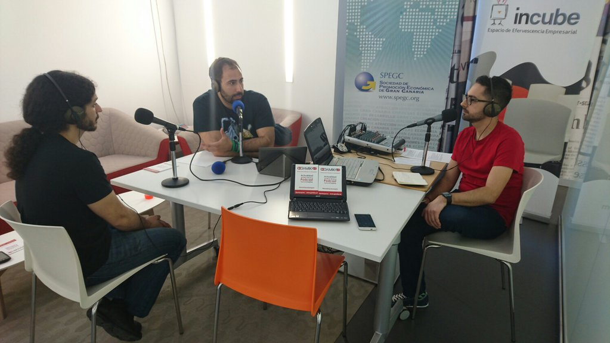
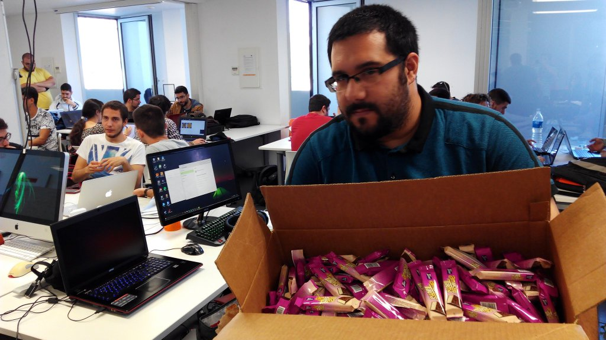
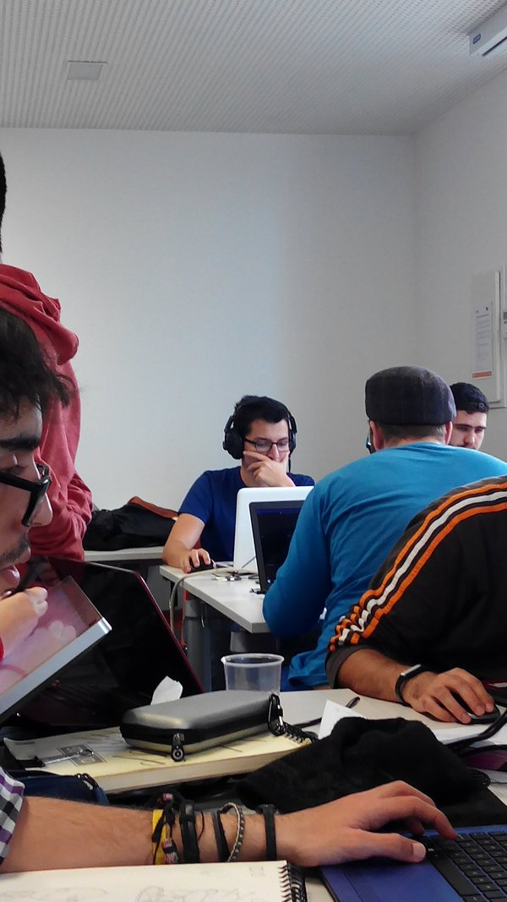
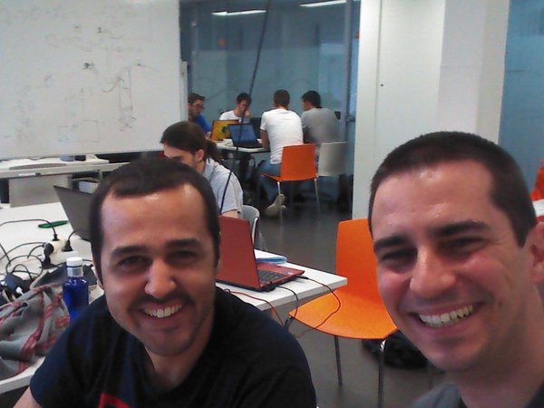
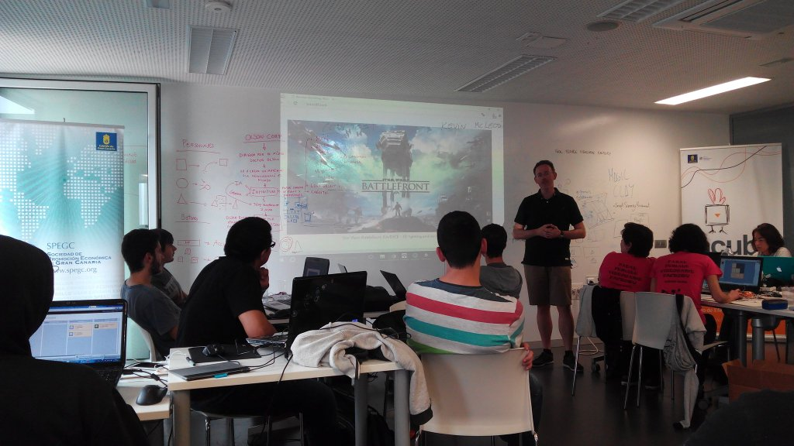
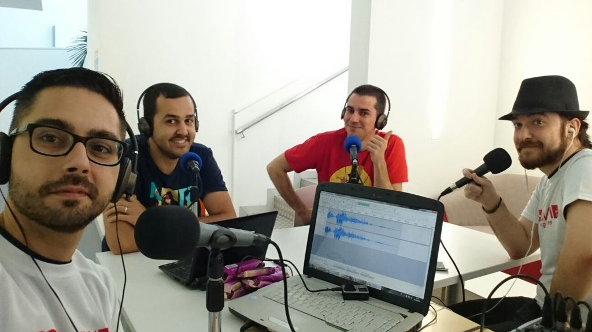
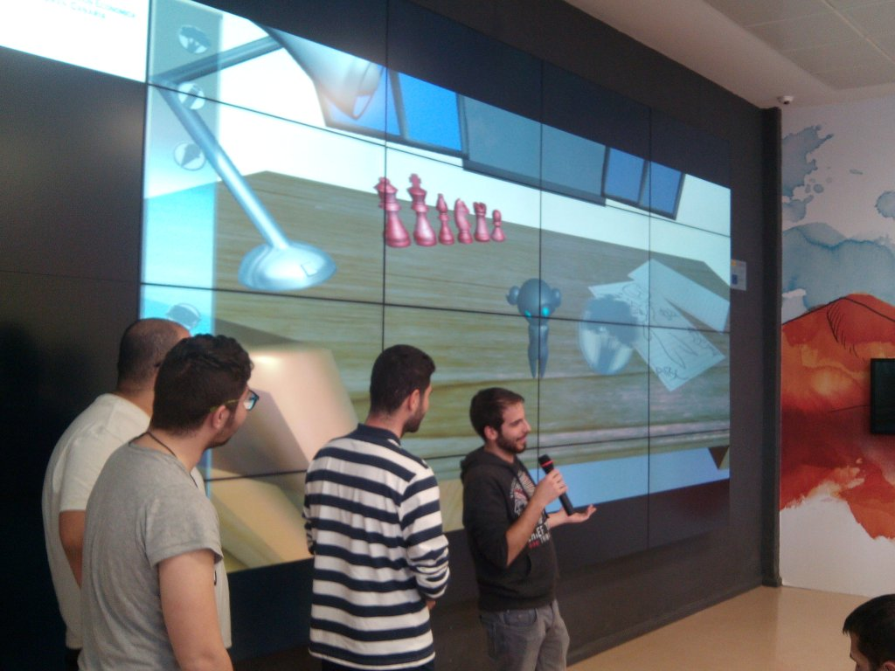
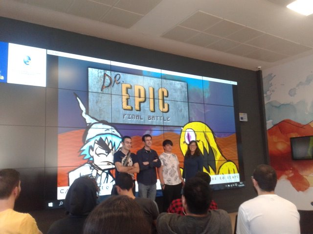
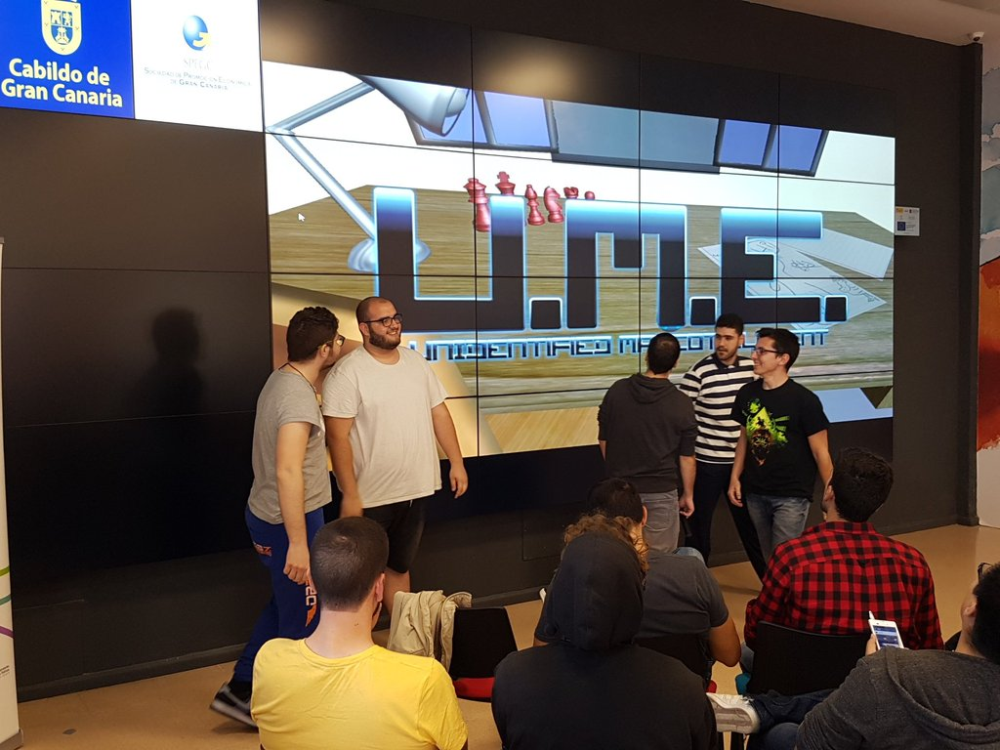
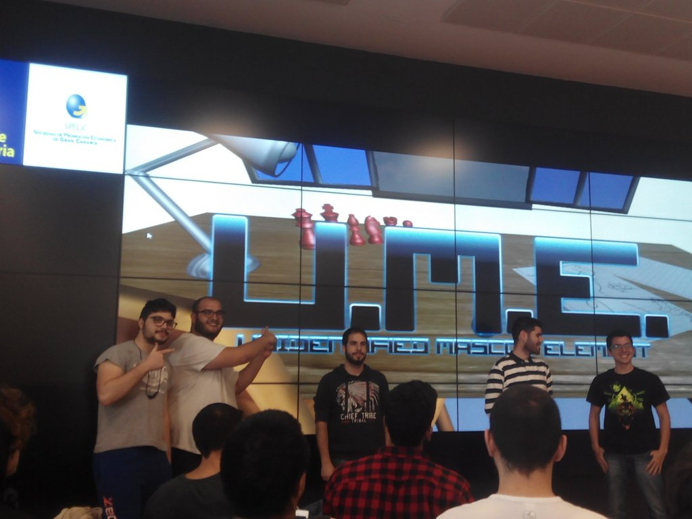

Buenas, hoy quería hablar sobre mi primera experiencia ludum. Aunque antes os voy a poner en contexto para todo aquel que desconozca el evento.

La ludum dare es un evento para realizar un videojuego cumpliendo con el tema propuesto en un plazo de 60 a 72 horas. Los juegos son votados y elegidos a nivel internacional.

La ludum dare GC es evento creado en Gran Canaria donde se reúne gente interesada en el mundo de los videojuegos con el fin de crear comunidad mientras disfrutamos desarrollando. La cosa no acaba aquí, se hacen charlas y en la última edición participó un grupo de mentores que ayudaron a los grupos a avanzar en sus proyectos.

Ahora que ya sabes lo que es una Ludum Dare. Contaré un poco de mi experiencia, así si alguien lee quizás se animé a participar o al menos tenga una visión de como es el evento.

## Dos días antes, clases de iniciación.

El evento no empezó en la ludum dare. Unos días antes se crearon unos cursos de unity y unreal para no iniciados. El curso a mi no me llamo especialmente la atención, al fin de al cabo estaba enfocado a las personas que iban al evento como soporte. De todas maneras valió la pena ir me enteré de algunos detalles interesantes sobre las plataformas y además conocí a varias de las personas con las que me reencontraría en la ludum.

## Primer día. Tarde del viernes, presentación y grupos.

Hubo un pequeño problemas con los horarios por lo que empezamos una hora después de lo que tenía pensando. Me lo tomo con filosofía, ya que estamos esperando hagamos algo de networking. Mientras hablaba me entere de que dan un grado sobre videojuegos en la ULGPC lo cual me sonó a canto celestial pues hasta entonces la única manera de conseguir una titulación en videojuegos era irse a la península. Por otro lado me llamo la atención que los participantes recorrían todo el espectro desde quinceañeros que empiezan a programar a hasta personas con años de experiencia.

Abren las puertas. Comienzan, con la presentación del evento y de los mentores, una serie de charlas interesantes y para finalizar se organizaron los grupos para mañana. Debo destacar la presencia unos increibles mentores que durante todo el evento estuvieron ayudando a los grupos, la ludum dare no hubiese sido la misma sin ellos.

## Segundo día, Hora de Trabajar

Problemas, muchas personas no se presentaron, de 100 propuestas nos quedamos en 60. A raíz, de esto hubo una reorganización de los grupos por lo que un nuevo miembro se nos un unió. Comenzaba a correr el tiempo hora de trabajar. El tema el cambio de forma. Me reúno con mi equipo y brainstorm.Acabamos con dos ideas. Mi idea un tamagochi con una mascota cambiaforma, y por otro lado un puzzle en 3D en el que para solventar los obstáculos debes cambiar de forma. Les consigo convencer de mi idea argumentando que podría desarrollar el juego en solo un día para después concrentarnos en mejorarlo. Sin embargo más adelante descubriría que me equivoqué.

 

 Al finalizar el día solo había avanzado la mitad de lo que tenía pensado. No conseguí mi objetivo y aunque nadie me culpo pero no creo que lo olvide fácilmente. Dediqué más tiempo del que debía a una tarea comprendí por la malas que en una ludum dare la prioridad es llevar todos los apartados del juego a un mismo nivel” tal como me aconsejó ” uno de los mentores.

## Último día, Fin de la Ludum

Trabaje bastante en la noche. Pero tras descubrir un bug en unity toca volver a montar el proyecto para solucionar un problema con las animaciones. Soy el que lidera el grupo, al mismo tiempo tengo que sacar el trabajo de programación, esto produce constantes interrupciones que me frenan. Aquí aprendí que sí es necesario para sacar el trabajo pide espacio la gente lo respetará.

Hora de la presentación no paro de pensar que parte del trabajo de mis compañeros sea desperdiciado por mi falta de experiencia me consuela haber salvado las animaciones con la ayuda de mis compañeros.

La presentación final fue muy divertida, se crearon juegos muy interesantes. El mío como otros se rompió o buggeo un poco a la hora de la verdad, pero no importaba realmente, es más era parte de la gracia.Pues solo se te pasabas realmente el juego cuando le encontrabas un bug. Al margen personalmente, me hizo especial ilusión una pregunta de unos de los participantes nos hizo “El juego, ¿vaís a terminarlo?”.

Después de las presentaciones hubo una pequeña jornada de networking comiendo pizza como de costumbre soy de los últimos en irme. Me despido y me voy a casa. De camino recuerdo mis errores y mis aciertos.Vuelvo a casa con la seguridad de que soy una persona un poco distinta a la que era antes de la Ludum Dare Gc 35.

 

Me dejo muchas cosas en tintero como la presencia de Gamika pero no quiero alargarme demasiado. Gracias a todos lo que formaron parte del evento.

 

Enlace a una versión del juego. No la que desarrolle en el evento pero casi.Le hice unas pequeñas modificaciones y más que nada la exporte a android.

[UME](https://jonay.itch.io/ume)

[Resume de los juegos por Gamika](http://gamika.es/articulos/10546/)
[Facebook de la Acadevi(actualizado)](https://www.facebook.com/AcadeviGameDev/)

