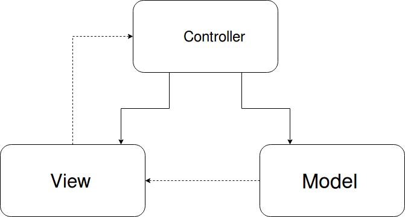
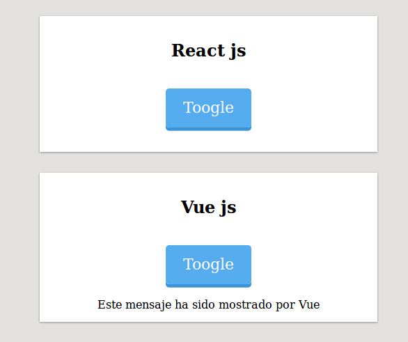

Hace muy poco me enseñaron la arquitectura modelo-vista-presenter con vista pasiva en javascript 
y no pude resistirme a hacer una prueba de conceptos. 
El punto fuerte de esta arquitectura es que permite un gran desacoplamiento
de la tecnología que se utiliza para interactuar con el DOM. Facilitando los test y teniendo
la libertad de usar la tecnología que mejor se adapte al contexto.

Vale, ahora que ya os he comentado las cosas buenas de la MVP con vista pasiva. Voy a desglosar
en que consiste, luego mostraré mi prueba de conceptos y por ultimo terminaré por explicar las 
ventajas e inconvenientes de esta arquitectura.

Desglosando MVP con vista pasiva
-----------------------------------------------------------------------------------------------------


**Modelo-vista-presenter**

Seguro que muchos conocéis el **modelo-vista-controlador**. En este modelo separamos los elementos de
nuestro programa según su responsabilidad todo lo que tenga relación con la interfaz de usuario,
en la vista, si estos elementos se corresponden con como persisten los datos los colocamos 
en el modelo y punto que sirve de enlace entre la vista y el modelo es el controlador.
También recordad que el modelo puede llamar a la vista y mostrar sus datos ya actualizados
pero la vista nunca puede llamar al modelo.



   

El **modelo-vista-presentador** mantiene el mismo concepto de separar las responsabilidades pero
es el presenter (alias controlador en mvc) quien se ocupa tanto de actualizar la información que muestra de la vista
 como de hacer las peticiones al modelo.Es decir, todo pasa por el presenter.


Llegamos al **mvp con vista pasiva**. Aquí se mantienen los conceptos del mvp.
Salvo que nuestra vista va a ser **tonta**, la vista no va a contener ninguna clase de lógica.
Simplemente va a tener una ordenes lo más básicas posibles que ejecutará el presenter.

Con esto se consigue ese desacoplamiento del que hablamos antes. Si la vista no tiene ninguna
lógica para cambiar la tecnología que utilizamos simplemente debemos cambiar el modo en
que se renderizan los elementos.

Prueba de concepto
---------------------------------------------------------------------------------------
Ahora que ya hemos visto los conceptos veamos como se hace.
La prueba de conceptos es sencilla voy tener un botón que va a ocultar o mostrar un mensaje.
Uno de estos botones funciona con React, el otro con Vue y ambos utilizan la misma lógica para
funcionar.




Primero de todo mostraré el presenter donde se encuentra la lógica.

```javascript

function TogglePresenter(view) {

    let isShow = true;
    view.subscribeToToggleMessageRequested(toggleMessage);
    toggleMessage();

    function toggleMessage() {
        isShow ? view.hideText() : view.showText();
        isShow = !isShow;
    }

    return {toggleMessage: toggleMessage}

}
module.exports = TogglePresenter;

```

Nuestro presenter recibe una vista. Esta vista puede estar trabajando sobre Vue, React, Jquery
que nuestro presenter trabajara igual.

Luego la vista se suscribe a nuestra funcionalidad.Ya volveremos a tocar este tema cuando lleguemos
a la vista.Pero si os fijáis el presenter esta manipulando la vista a través 
del método toggleMessage y se lo esta devolviendo en **view.subscribeToToggleMessageRequested(toggleMessage);**
Es decir, el presenter le está indicando a la vista como tiene que comportarse usando sus propios 
métodos y después le pasa este comportamiento a la vista.

El resto del presenter no es muy importante.Solo tiene lógica de como se comporta, oculta el
mensaje al empezar y maneja un estado.

Este presenter fue construido usando tdd. Para ello falseamos la vista y testeamos el comportamiento
de la vista con el presenter como resultado generamos la estructura de la vista.

```javascript

function ToggleViewEmpty(){

    function hideText() {
        throw "not implemented";
    }

    function showText() {
        throw "not implemented";
    }

    function subscribeToToggleMessageRequested (handler) {
        throw "not implemented";
    }

    return {
        hideText: hideText,
        showText: showText,
        subscribeToToggleMessageRequested:subscribeToToggleMessageRequested
    }
}

module.exports = ToggleViewEmpty;

```
  
  
La vista no la testeamos. La idea es crear una vista tan tonta que no tenga caso testearla.
Siempre que se cumpla la norma y la vista sea tonta. Lo ideal, es conseguir una vista 
que si la testearamos nos encontraríamos testeando la libreria que usa más que la propia vista.

El siguiente paso seria sobre la estructura de la vista con la que trabaja el presenter y sin romper los test
implementar la vista ya funcional. Normalmente, esto se hace directamente sobre la función, pero
dejaré esta clase de referencia para la gente que quiera ver el repositorio. Por
lo que copio el archivo, lo renombro e implemento la vista con React.


```javascript

const React = require('react');
const ReactDom = require('react-dom');

function BoxViewReact(){

    let subscribeToToggleMessageRequestedHandler;

    function hideText() {
        ReactDom.unmountComponentAtNode(document.getElementById('container-message-react'));
    }

    function showText() {
        ReactDom.render(<MessageBox />, document.getElementById('container-message-react'));
    }

    function subscribeToToggleMessageRequested (handler) {
        subscribeToToggleMessageRequestedHandler = handler;
        renderBox();
    }

    function renderBox(){
        class BoxReact extends React.Component{
            render(){
                return (
                    <div  className="box">
                        <h2 className="titleBox">React js</h2>
                        <div className="btn" onClick={subscribeToToggleMessageRequestedHandler}>Toogle</div>
                        <div id="container-message-react"/>
                    </div>)
            }
        }
        ReactDom.render(<BoxReact/>, document.getElementById('box-react'));
    }

    class MessageBox extends React.Component{
        render(){return <p className="messageBox">Este mensaje ha sido mostrado por React</p>}
    }

    return {
        hideText: hideText,
        showText: showText,
        subscribeToToggleMessageRequested:subscribeToToggleMessageRequested
    }
}

module.exports = BoxViewReact; 
```

En cuanto al método "subscribeToToggleMessageRequested" es un método que es llamado en el
presenter donde este le pasa una función que ejecutara la vista cuando el usuario
ejecute algún evento. En nuestro caso el click sobre el botón.

Si nos fijamos en las implementaciones vemos como la función que recibe la vista desde
el presenter(subscribeToToggleMessageRequestedHandler) es directamente lo que ejecuta en el Click.


Todo funciona perfectamente, pero a medida que avanza las semanas por alguna razón 
ahora nos interesa trabajar sobre Vue en lugar de React. Que hacemos simplemente cambiamos
la vista y en lugar de trabajar con React a partir de ahora trabajará con Vue. Manteniendo toda
la lógica de la aplicación intacta.


```javascript
import Vue from 'vue';

function BoxViewVue(){

    let subscribeToToggleMessageRequestedHandler;
    let VueBox;

    function hideText() {VueBox.show = false;}

    function showText() {VueBox.show = true;}

    function subscribeToToggleMessageRequested (handler) {
        subscribeToToggleMessageRequestedHandler = handler;
        renderBox();
    }

    function renderBox(){
        VueBox = new Vue({
            el: '#box-vue',
            data:{show:true},
            methods:{
                subscribeToToggleMessageRequestedHandler:subscribeToToggleMessageRequestedHandler
            },
            template: `
            <div  class="box">
                <h2 class="titleBox">Vue js</h2>
                <div class="btn" v-on:click="subscribeToToggleMessageRequestedHandler">Toogle</div>
                <div v-if="show">Este mensaje ha sido mostrado por Vue</div>
            </div>`
        });
    }

    return {
        hideText: hideText,
        showText: showText,
        subscribeToToggleMessageRequested:subscribeToToggleMessageRequested
    }
}

module.exports = BoxViewVue;
```
---------------------------------------------------------------------------------
 

Ventajas e Inconvenientes
-------------------------------------------------------------------
Es cierto, que ahora la lógica es un simple toggle pero este sistema funcionará igual 
si se tratara de un componente mucho más complejo. 

Algunas cosas no tan buenas y vale la pena contarlas.
 No tenemos componentes en el sentido estricto de la palabra.Quiero decir, 
organizamos los presenter y las vistas como si fueran componentes.
Pero ni el javascript, ni los estilos y muchas veces ni el html están ligados entre si
salvo por unas clases css y unos id de html.Lo que significa que no podemos quitar
todos los elementos de un componentes simplemente dejando de usar un archivo de javascript.
Normalmente mantenemos la vista y el presenter en el mismo archivo. Con lo cual
nos funciona bastante bien. Pero no se puede ignorar que conseguimos este desacoplamiento
atacando al Dom directamente. Con lo que a veces hay tocar en varios archivo para lo que solo
es responsabilidad de un componente.
 
Esta arquitectura tiene algunos sacrificios como no poder utilizar toda la potencia de una
tecnología porque todas estas tecnologías las orientamos a nuestra arquitectura
y no realmente a como están pensadas para funcionar.Por ejemplo, en caso de la implementación
de React juego con el método **ReactDom.unmountComponentAtNode** para desmontar y 
ocultar el nodo del mensaje y React no esta pensado para funcionar de esta manera.

Por otro lado implementar una vista sin ninguna lógica puede
ser más difícil hacerlo en la practica de la que uno pudiera imaginar en 
un primer momento. Por ejemplo, en la implementación con vue no supe hace una vista
totalmente tonta para este contexto. Si os fijáis dentro del objeto de Vue existe
un estado show que me vi a obligado a crea para interactuar con la vista. Ya
tengo en el presenter un estado y ahora en Vue tengo otro estado que no me aporta.
En consecuencia añado una complejidad innecesaria por la manera en la que trabaja vue.

También es cierto que para este caso yo realmente usaría Jquery
con el método show y hide se adaptaría perfectamente a lo que necesito.
Y en el contexto de mostrar una estructura de datos es cuando uso React o Vue
por lo que puedo elegir la mejor herramienta que se adapte a mi arquitectura y a mi contexto
teniendo una gran libertad para trabajar con varias herramientas.

Por otro lado, simplifica los test, como tiene un gran nivel de abstracción ya no son necesarios hacer
test frágiles de integración para comprobar el DOM.

Sinceramente, el otro dia hicimos una prueba para estudiar si nos compensaba empezar a mudarnos
de React a Vue. Probamos con un componente que era básicamente una agenda de citas y 
en poco más de una hora habíamos mudado el componente de React a Vue sin apenas errores
y sin apenas conocer como trabaja Vue. Lo cual demuestra lo realmente cómodo que
es cambiar de tecnología.


La verdad es que aun estoy empezando a manejarme con ella pero ya estoy disfrutando de 
la gran flexibilidad que permite.
  

Para terminar os dejo un par de enlaces que os lleva a la prueba de conceptos de github.
<a href="https://github.com/jonayGodoy/proof_of_concept_pasive-view" target="_blank">el repositorio</a>, 
<a href="https://jonaygodoy.github.io/proof_of_concept_pasive-view/" target="_blank">una página de github con el concepto</a>