Hace poco que he empezado a tocar c# y con el Visual Studio.
Por supuesto, esto incluye el plugin ReSharper de jetbrains para Visual Studio.

El plugin tiene un montón de funcionalidades muy potentes, la que más destaca a 
mi parecer son sus refactors automáticos. Sin embargo, hoy hablaré otra funcionalidad
menos espectacular pero muy útil Search Pattern o patrones de búsquedas de ReSharper.

Search Pattern
-------------------------

Vamos a empezar con un ejemplo de Search Pattern bastante sencillo.

En la imagen que acabamos de ver, tengo una string seleccionada. Vamos a 
imaginar por un momento que esa string por lo que sea para nuestro equipo
de trabajo representa un mal olor. Si ese mensaje no está mal pero no
termina de expresar todo lo que debería.

Por eso, nos interesa que si un miembro del equipo se encuentra con un
caso similar al mío, sea el mismo IDE el que le avise de que se encuentra ante
un mal olor. Aquí es donde aparecen los **Search Pattern**.

**Hay dos maneras de hacer un search pattern** 

- De cero.
- A partir de un fragmento de código.

De cero
-------------------

Vamos al menú de ReSharper y dentro de este vamos a Options.
    
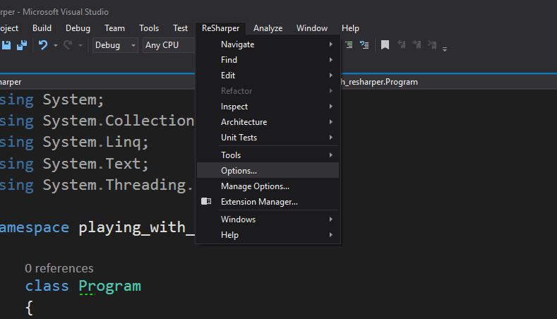

Dentro nos aparecerá el siguiente menú y pulsamos sobre add pattern

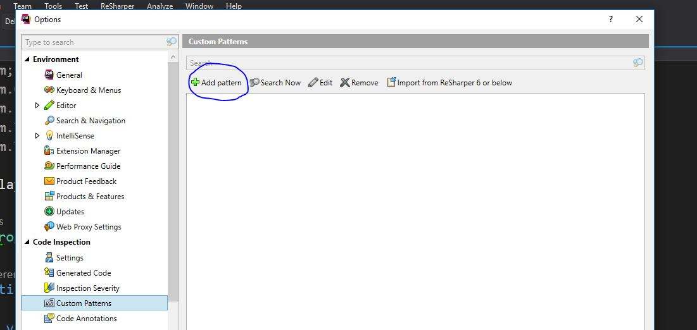

Siguiente paso, después de que aparezca la siguiente ventana pulsamos en Find para
movernos a la ventana donde estaremos trabajando. Tranquilos ya volveremos al tema del
replace más adelante.

Ya hemos llegado a la ventana de Find. Yo os la muestro aquí ya rellena.
Pero esta parte es bastante sencilla en el gran cuadro ponemos los que queremos
que busque, en **pattern severity** ajustamos el tipo de warnings que mostraremos
cuando se produzca este mal olor. Para mí este error es imperdonable y voy a poner
error y la description es eso, la descripción que va a aparecer junto a nuestro warnings.

Le damos a Add, nos retornará a la anterior ventana y luego pulsamos en save.
Y magia ya nuestro propio editor es el que nos avisa de este nuevo mal olor.

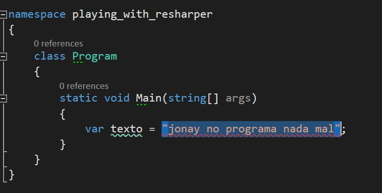

A partir de un fragmento de código.
--------------------------------------

Esta forma es más rápida. Seleccionamos el código a partir del cual queremos crear un nuevo patrón
le damos al botón secundario y pulsamos sobre "Search with Pattern...".

A continuación nos aparecerá un nuevo modal parecido a otros que hemos visto con anterioridad.
Le damos a guardar.

Tras eso nos parece un pequeño modal que nos avisa de que nuestro nuevo patrón 
sé ha guardado y lo podemos encontrar dentro de opciones. Le hacemos caso y nos vamos a
buscar el nuevo search pattern en las opciones.

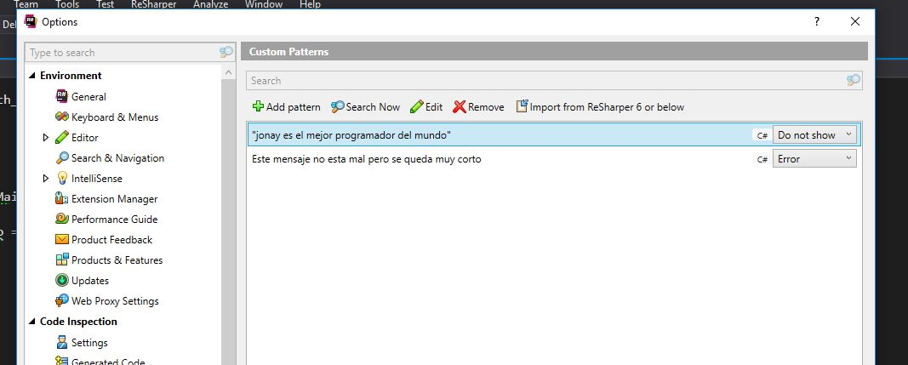

Listo, ahora podemos ajustar el pattern severity para que nos aparezca el warnings y a diferencia
de cuando lo hacemos de cero ahora nos va a coger el propio código seleccionado como descripción por
defecto, cosa que por supuesto podemos cambiar pulsando edit.

Creando nuestro propio refactor automático
--

Ahora que ya hemos creado nuestro search pattern vamos a ir un paso más allá. Partiendo de este
search pattern podemos crear su correspondiente refactor automático.Volvemos a ReSharper -> options.. 
y dentro entramos al menú de custom pattern donde volveremos a editar nuestro patrón está
vez sobre la pestaña replace.

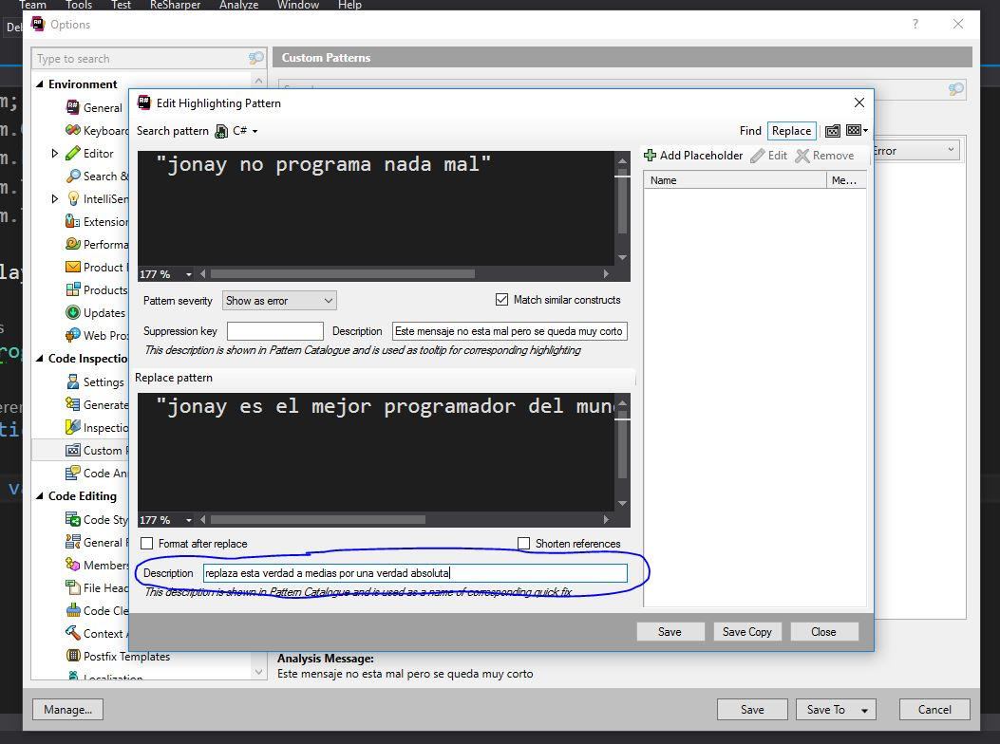

Esta vez encontraremos un segundo recuadro donde pondremos el código que va a reemplazar al
primero. En este caso sustituiremos "jonay no programa nada mal" por 
"jonay es el mejor programador del mundo". También tenemos un nuevo campo description 
esta descripción es la que aparecerá en las opciones para refactorizar.
Una vez lo tengamos todo configurado guardamos.

Ahora si volvemos a nuestro código, podemos ver como además de mostrarnos un warning nos muestra
unas opciones para refactorizar de manera automatica.

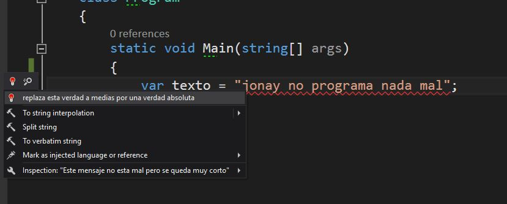

Un caso real
-----

Hasta aquí, la parte más sencilla aunque sé que todo el mundo está deseando que comparta este 
patrón esencial para todo programador voy poner un ejemplo en un contexto más real.

Supongamos que en nuestro equipo de trabajo, tenemos que trabajar procesando palabras.
Entonces, en este contexto separar palabras y hacer algo con esas palabras en una rutina
casi diaria para nosotros.

Hoy nos encontramos haciendo un método que separe las palabras de una frase las ponga en 
mayúsculas y las vuelva a unir (perdón, se que existe un Join no se porque no lo recordé 
hasta terminar el ejercicio).

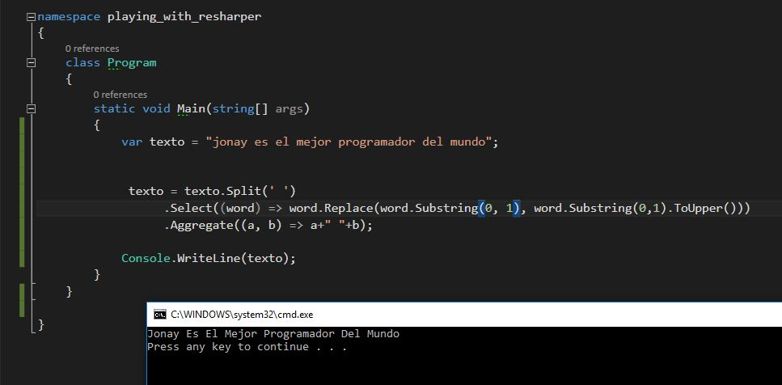

Pues digo basta estoy harto de escribir Split, Select, y Aggregate una y otra vez por todo
mi código y decido crear un método para que yo y mi equipo podamos utilizar.

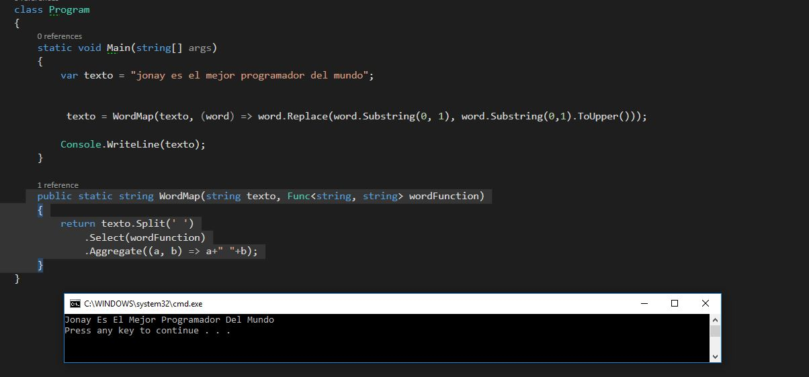

Hasta aquí todo perfecto. Pero un día otro miembro de equipo se encuentra en situación de 
usarlo. Sin embargo, desgraciadamente no se acuerda, es normal, con el tiempo se han
ido acumulando métodos en el equipo y empieza a ser un esfuerzo adicional acordarse de todos.
No importante este método enumera las palabras (existen otras maneras más declarativas de
escribirlo pero para no añadir una complejidad innecesaria a los siguientes pasos lo 
construí asi.)

Para resolver este problema vamos a construir un search pattern que nos sugiera que existe
una implementación alternativa y nos proporciones un refactor automático.
Para ellos voy a seleccionar el fragmento de código del que queremos detectar como un
warning y pulsamos el botón secundario del ratón para después pulsar sobre "Search with pattern...".
Nos aparecerá un modal, antes de seguir avanzado vamos a fijarnos en algunas cosas que han cambiado
respecto al ejemplo anterior.
 

 
En el panel de la derecha podemos observar que parecen una serie de nuevos parámetros estos 
son placeholders. Los placeholder declara poniendo cualquier palabra entre el símbolo del 
dolar $placeholder_name$ . Estos placeholder se utilizan para reestructurar el código, es decir, podemos
por ejemplo identificar **$texto$** como una variable y hacer referencia a está variable
a la hora de hacer el replace.

Cada marcador de posición se debe definir una vez y se puede usar varias veces en el patrón. 
Al definir un marcador de posición, debe definir sus restricciones tipo y opcional

Hay cinco tipos de marcadores de posición:

 - **Argument Placeholder** - Uno o más argumentos en la invocación a un método.
 Si es necesario, puede especificar el número mínimo o máximo de argumentos que deberían coincidir.

 - **Expression Placeholder** - una secuencia de operadores y operandos.
 Opcionalmente puede especificar un tipo que devuelve está expresión.

 - **Identifier Placeholder** - Cualquier identificador de símbolo.He tenido pocas
 dificultades con las refactorizaciones search pattern. Uno de ellos fue que muchas
 veces los patrones que creaba ReSharper no era capaz de encontrarlo. Este problema
 normalmente, lo solucionaba sustituyendo el placeholder que me daba problemas por
 un identifier placeholder.
 También puede especificar una expresión regular que se utilizará para hacer coincidir nombres de símbolos.

 - **Statement Placeholder** -
 una sentencia de única línea que termina con un punto y coma o un bloque de instrucciones. 
 Si es necesario, puede especificar el número mínimo o máximo de declaraciones que deberían coincidir.

 - **Type Placeholder** -
 Un tipo de valor o un tipo de referencia. De forma predeterminada, 
 un marcador de posición de este tipo coincidirá con cualquier tipo, 
 pero puede especificar un tipo específico explícitamente.

Tenga en cuenta que es muy importante elegir los tipos correctos de marcadores 
de posición para partes específicas de su patrón. 
Si su patrón no coincide con el bloque de código al que corresponde,
 el problema suele ser con tipos de marcadores de posición elegidos incorrectamente.
 
Después de este paréntesis regresamos al a nuestra ventana.Ahora en lugar de guardar el patrón
 vamos a darle primero a find.
 
 

Ahora aparecerá un menú donde se mostrará los puntos en el código que han coincidido con nuestro
patrón ¿Cuantas coincidencias conseguiremos? 

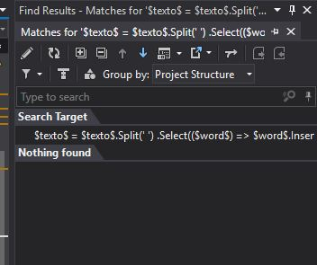

0 coincidencias. Parece que desgraciadamente los search pattern que construye ReSharper a partir
no son tan buenos como esperábamos.Cuando sigo la siguiente estrategia.
Pulsamos el botón editar para cambiar el patrón de nuestra búsqueda.

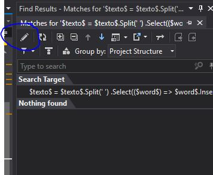
 
Lo que vamos a hacer es remover todos los argumentos y volver a repetir la búsqueda.
Para remover un argumento basta con remover los simbolos del dolar "$" que lo acotan.
Como solo queda exactamente las letras que compone nuestro código encontrará nuestra
coincidencia.

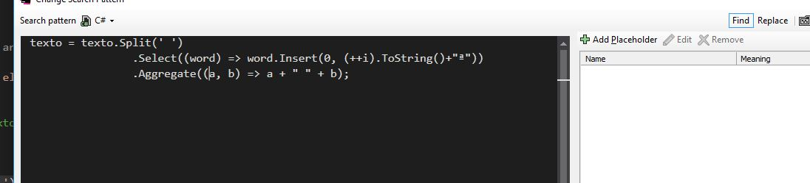

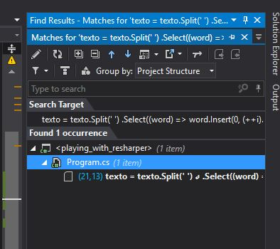

A continuación, uno a uno vamos añadiendo volviendo a añadir cada uno de los argumentos
que Resharper nos creo. Después de restaurar uno de ellos repetimos la búsqueda para saber
si este argumento era el culpable de que encontrará coincidencias.
Empezamos con texto.

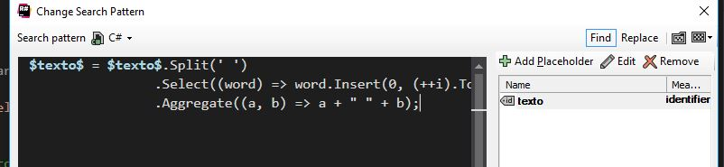

Lo ejecuto y veo que sigue encontrando coincidencia. Para el siguiente vamos a hacer algo
un poquito distinto como nuestra WordMap trabaja con funciones reemplazamos la
lambda por un argumento que la represente.Repetimos la búsqueda y aun nos sigue dando
coincidencias, perfecto.

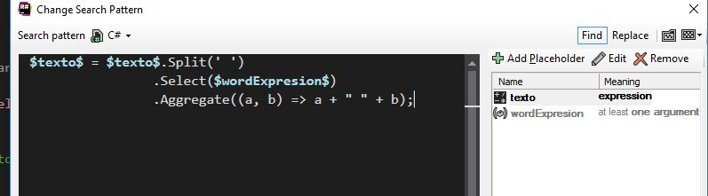

Por eliminación, supongo que eran los argumentos A y B del método Aggregate lo que
nos daba problemas para encontrar las coincidencias.Lo comprobamos creamos estos
argumentos y probamos.No coincide.

Como en la documentación recomienda cuando un search pattern no coincide a menudo es problema
de un placeholder mal planteado ya sea por nosotros o como está vez por ReSharper. Ahora
que me hemos localizado los argumentos que fallaban los podemos cambiar por otro tipo de 
placeholder. En este caso los he sustituido por Identifier Placeholder.

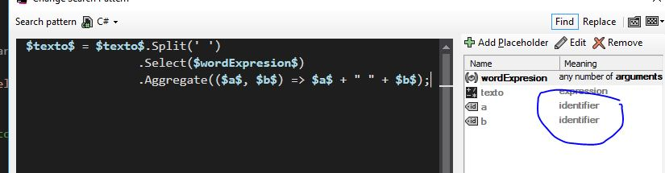

Ok, volvemos a repetir la búsqueda está vez si trabaja por lo que ya tenemos nuestro search
pattern. Pulsamos en guardar y volvemos a Resharper -> options. Seleccionamos nuestro
patrón, cambiamos las descripciones y lo más importante en el refactor automático colocamos
nuestro método WordMap colocando los placeholder según corresponda.

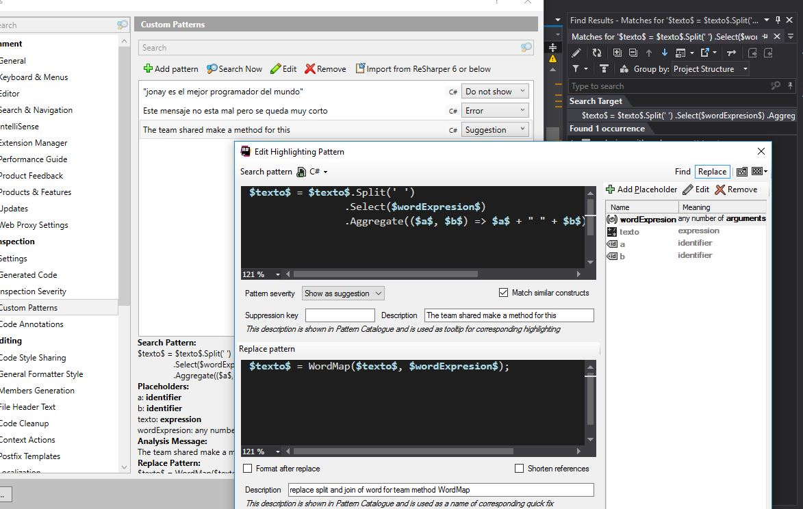

Guardamos y lo probamos debería detectar el código con el mal olor y ofrecernos el refactor
apropiado.

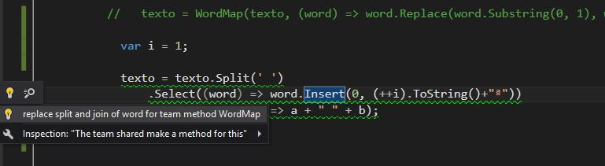

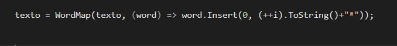

Esto ha sido todo, en este artículo solo he explicado los search pattern pero está funcionalidad
solo es una pequeña parte de todo los que ofrece ReSharper cuyo punto fuerte es los refactors
que ya incluye. Sin duda en plugin con mucha potencia pero a pesar de ello no resulta nada
complejo empezar a trabajar con él. En la actualidad es plugin que debería tener todo usuario de
Visual Studio.

[Referencia - documentacion - search pattern](https://www.jetbrains.com/help/resharper/Navigation_and_Search__Structural_Search_and_Replace.html)