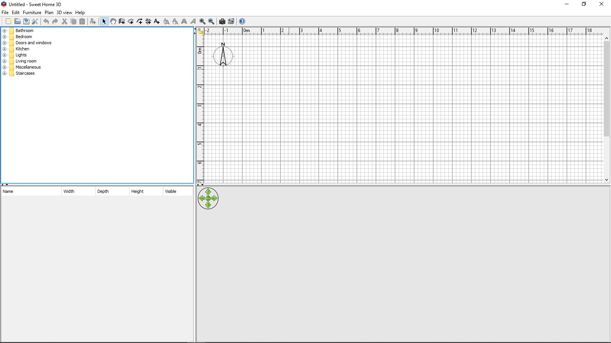
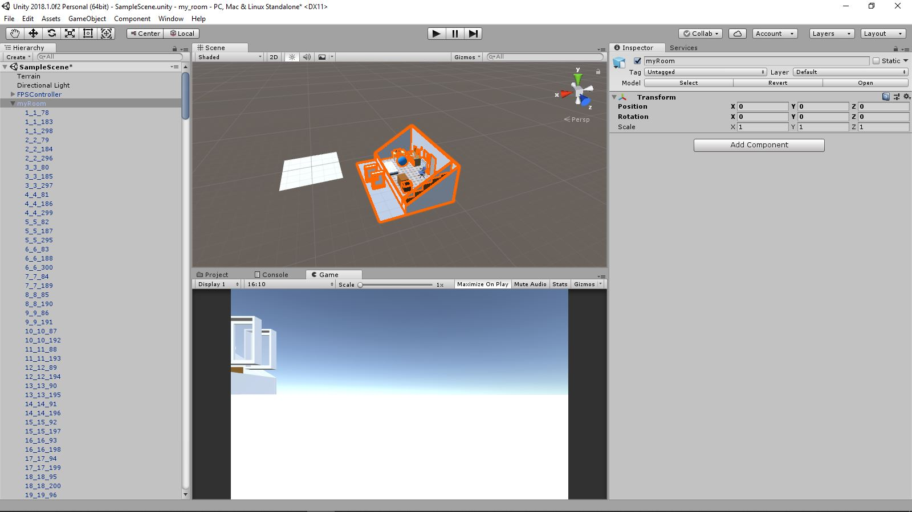
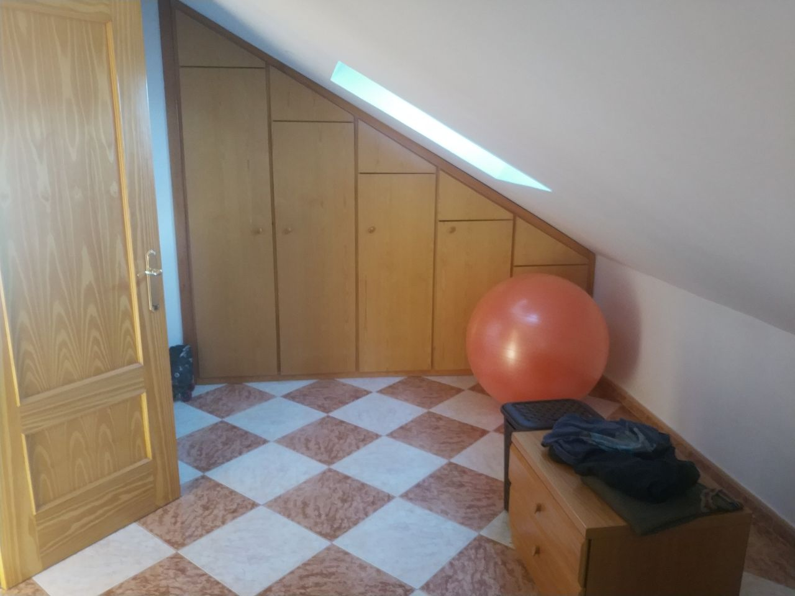
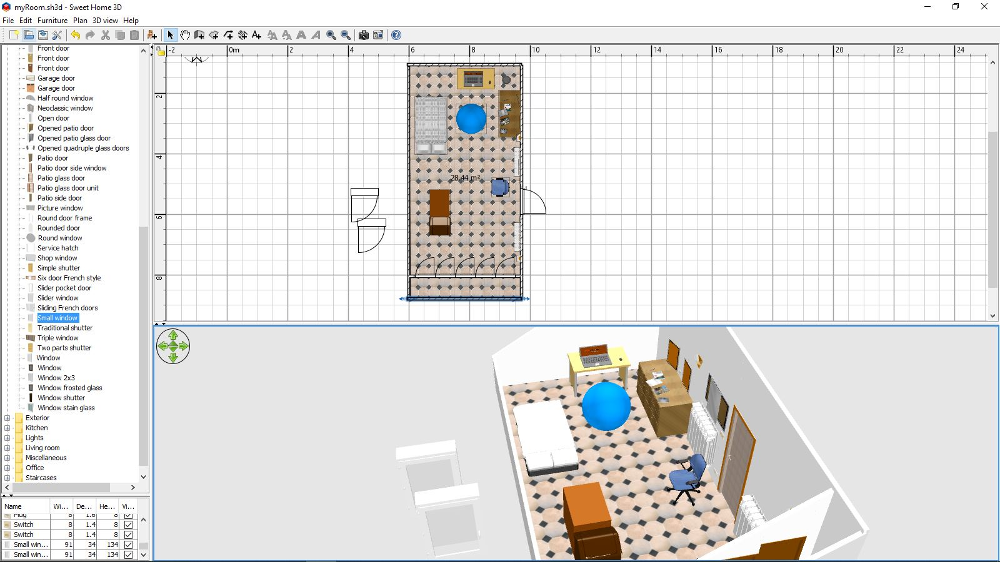

Llevo tiempo queriendo escribir un articulo sobre este programa que me ha sido
bastante útil en algunas ocasiones, generalmente esas ocasiones eran jams de videojuegos.
Siempre me ha parecido muy fácil y cómodo de usar.
Aunque por supuesto como todas las herramientas tiene sus limitaciones.

Sweet home 3D es un programa que te permite crea interiores de habitaciones o casas
en 3D de una manera muy muy fácil.**Si has podido jugar a los sims puede usar este programa.**
Además es open source.

<a href="http://www.sweethome3d.com/es/" target="_blank">
    Página web de Sweet Home 3D
</a>

Puntos fuertes
----------------------------------------------------------

- El programa viene como muchos muebles totalmente libres y en la propia página te puedes descargar
aun más modelos con las mismas características.Y por supuesto puedes añadir los tuyos.
Trae pocos modelos por lo que si tenéis en la cabeza trabajar un poco con el, y no solo jugar
un rato recomendaría descargar inmediatamente un pack en su propia página con más muebles.
El pack que suelo usar añade 469 modelos y se usan.Sobre todo porque cada tipo de habitación
necesita su propia variedad de muebles, obviamente no es lo mismo una cocina que un dormitorio.

- Yo no soy modelador, este programa da a
personas como yo la oportunidad de crear espacios en 3D
de manera muy rápida y con una calidad bastante aceptable.También es una opción
valida crear una habitación básica con este programa para más tarde con
esta base, empezar a mejorarla en una herramienta de más calidad como el blender.

- Tiene una opción de visita virtual, que simula el punto de vista de una 
persona que se mueve por la habitación.

Puntos debiles
-------------------------------------------------------------------------------------

- Cuando se exporta el resultado final en un programa. Aparecen un motón
de partes diminutas. Por lo que el tiempo de crear la habitación hay que sumarle
el tiempo de organizar los elementos en unity, por ejemplo o si quieres un mejor resultado
el tiempo de unir la diferentes mallas con algún programa de edición 3D.

- Se hace necesario un buscador de muebles. De momento los modelos solo se almacenan por carpetas
 por esto pierdo tiempo buscando un mueble en concreto o cuando intento comparar varios muebles similares como mesas.

- Algunas opciones son un poco escasas sobretodo al añadir detalles.
Por ejemplo, las opciones para añadir texturas al suelo y las paredes
son escasas se reducen a pintar con un color o poner una textura como si fueran molduras.

- Si vas a reproducir lugares de mundo real quieres total exactitud. Tendrás que saber modelar
muebles, usar un programa para crear muebles en 3D o aceptar colocar un mueble que se le parezca
y permitirte no ser del todo exacto. Por otro lado, acabo de descubrir que el programa no sabe construir techos en diagonal.
Pero estos detalles no los considero realmente puntos debiles más bien son cosas con las que me encontrado.

**En resumen**, Sweet home 3D, es un programa muy útil y tan facil de manejar que si
alguien se aburre puede dedicar una tarde a jugar con el programa.
Yo lo he hecho en alguna ocasión, he construido una reproducción de mi habitación o **he diseñado mi casa ideal**.

Dejo por aquí una reconstrucción de mi habitación de Madrid que hice en 1 hora y media 2 horas.
Con más tiempo y complementandolo con otros programas se puede conseguir un resultado más profesional.
Hice una demo para que podaís recorrer la habitación usando unity.

- Mi habitación real.

    
    
    

- Mi habitación en sweet home 3D.
    

- Mi habitación en una demo creada con Unity 3D.
Recomiendo probar la demo en pantalla completa.
<iframe src="https://itch.io/embed-upload/943355?color=333333" allowfullscreen="" width="980" height="320" frameborder="0"></iframe>